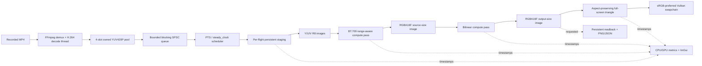

# Phase 1 architecture

## Threads and ownership

The decoder owns the FFmpeg contexts. It blocks for a free index, decodes into that preallocated slot, copies each visible plane row (never exporting borrowed `AVFrame` pointers), then publishes the index. `FrameQueue` uses a mutex and two condition variables solely around fixed-capacity state transitions. No lock is held during decode, plane copy, scheduling, upload, or rendering. Full queues preserve frames; stop wakes both sides. A separate preallocated display slot lets pause/repeat release queue ownership immediately.

The main thread owns GLFW, every Vulkan object, ImGui, the playback clock, and presentation. RAII destruction runs after the decode thread is stopped and the device is idle. Recoverable initialization and FFmpeg errors cross the application boundary as contextual exceptions; the frame hot path does not use exceptions for control flow.

## Timing

`best_effort_timestamp × stream.time_base` produces seconds. The first displayed PTS is paired with `steady_clock::now()`, and every target is `wallStart + (pts - firstPts)`. Coarse sleeps end roughly one millisecond early, followed by yields. Pause shifts the wall origin; seek and loop reset it. Frame dropping is disabled unless severe lateness and `--drop-late-frames` are both present.

## Vulkan dataflow and synchronization

There are three independently owned flight resource sets: mapped staging/readback buffers, Y/U/V images, source-size RGBA16F, and output-size RGBA16F. This prevents one submitted frame overwriting another flight's inputs or result. Normal layout sequence:

| Resource | Upload/compute/present sequence |
|---|---|
| Y/U/V | `UNDEFINED` or `SHADER_READ_ONLY` → `TRANSFER_DST` → `SHADER_READ_ONLY` |
| RGBA16F working | `UNDEFINED`/`GENERAL` → `GENERAL` storage write → `GENERAL` sampled read |
| RGBA16F output | `UNDEFINED`/`GENERAL` → `GENERAL` storage write → `GENERAL` fragment read |
| screenshot only | output `GENERAL` → `TRANSFER_SRC` → `GENERAL`; readback transfer-write → host-read |

Host writes are flushed for non-coherent memory. Explicit transfer/compute/fragment barriers establish visibility. Phase 1 uses Vulkan 1.2 barriers for broad driver portability and reports synchronization2 availability; the ownership boundaries allow a localized synchronization2 upgrade.

Timestamp queries bracket upload, conversion, upscale, present, and total work. Results are read only after the corresponding flight fence signals, so profiling does not serialize the current GPU frame.

## Color and presentation

The conversion pass expands studio range before applying the selected YUV matrix. Left-sited 4:2:0 chroma is sampled through a linear sampler with an explicit phase mapping. The nonlinear, sRGB-like result stays nonlinear in RGBA16F. For an sRGB swapchain the present shader decodes to linear and the attachment performs the single encode; a UNORM fallback writes encoded values directly. Letter/pillar bars are cleared black.

## Allocation policy and extension points

Pool planes, queue rings, GPU resources, descriptor sets, commands, queries, and synchronization are initialized once. Accepted allocation exceptions are FFmpeg internals, ImGui internals, screenshot conversion, swapchain recreation, and seek/reinitialization. Future Lanczos/FSR passes plug in between working and output images; a live source can replace the decoder producer and select a drop-oldest policy without changing frame ownership, scheduling, or presentation. NV12 and zero-copy require new uploader implementations rather than changes to the baseline contract.

